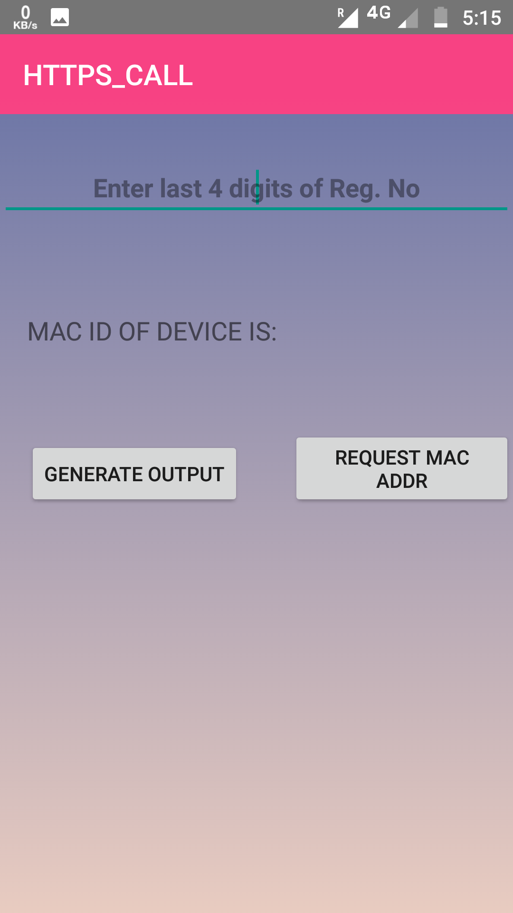
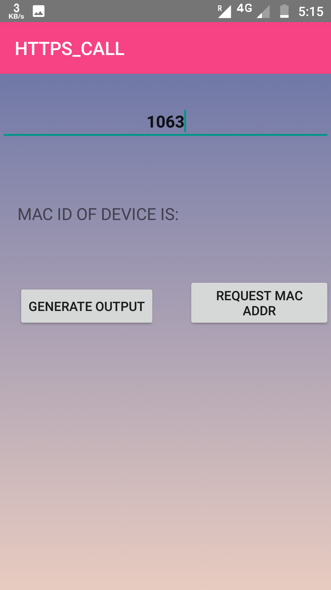
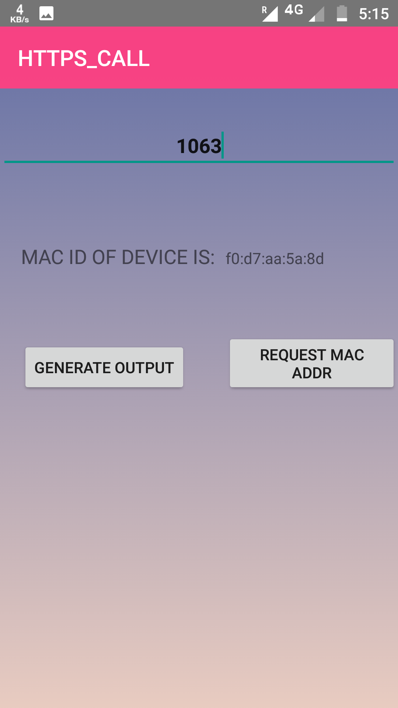
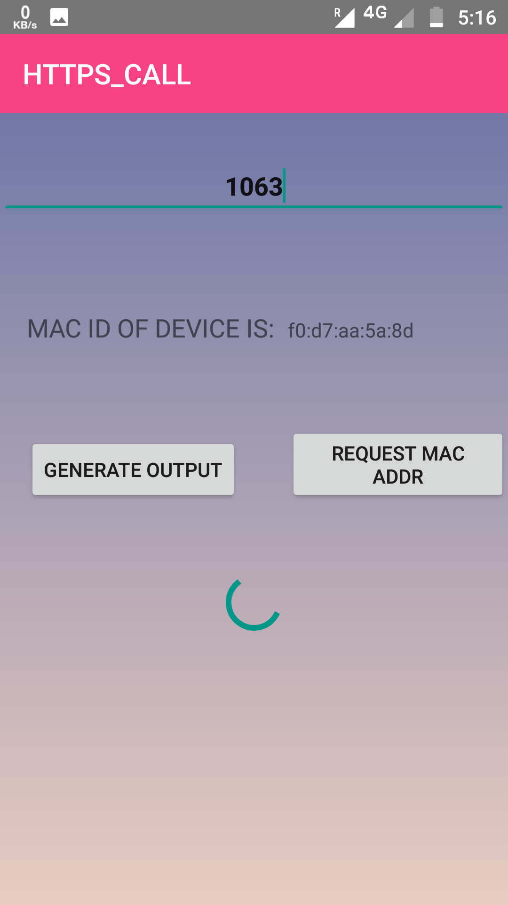

<h1>HTTPS CALL App</h1>

 This is the Splash Screen of the App 

This is the MainActivity where we need to enter our registration number and we will get the response from the server.

On clicking the Get Mac Address, we will get the MAC Address of the Device

